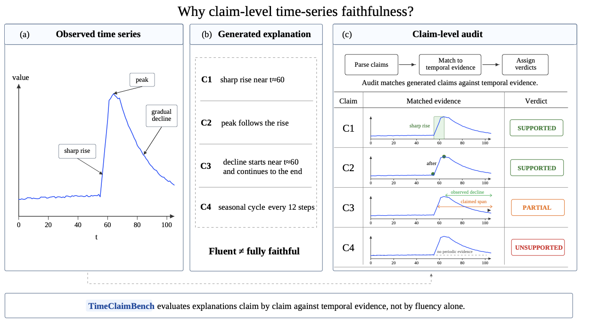
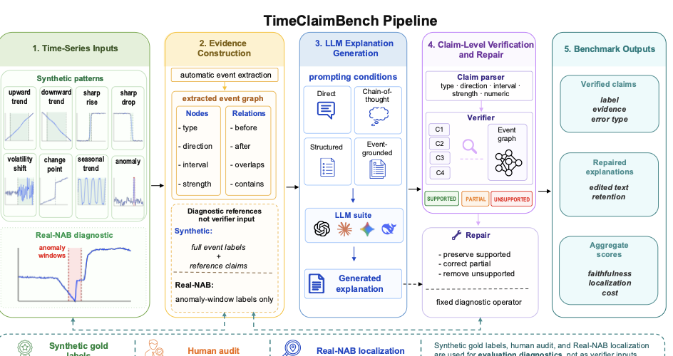

# TimeClaimBench: A Claim-Level Benchmark for Grounded LLM Explanations of Time Series

Companion code and data artifact for the EMNLP 2026 Findings paper.

## Motivation

LLMs can produce fluent time-series explanations that still contain unsupported temporal claims, wrong intervals, or hallucinated patterns. TimeClaimBench evaluates explanations at the claim level: each generated claim is parsed, matched against temporal evidence, and assigned a support verdict.



## Pipeline

TimeClaimBench turns each time series into an event graph, asks LLMs to generate explanations under several prompting conditions, verifies every extracted claim against temporal evidence, and applies verifier-guided repair to remove or correct unsupported claims.



## Key Results

- Event-grounded prompting gives the strongest **operational extracted-event support** on the synthetic benchmark: strict `SUPPORTED` is `0.676` vs. `0.493` for Direct, and operational `UNSUPPORTED` falls from `0.392` to `0.113`.
- Verifier-guided repair improves operational strict support from `0.704` to `0.991`, while reducing operational `UNSUPPORTED` from `0.138` to `0.006`.
- Event-graph verification is substantially stronger than type-only checking: Macro-F1 `0.733` vs. `0.456`.
- Real-NAB diagnostics show high anomaly-window localization hit rate (`0.960`), while claim-level support remains harder in real-world data.

These automatic quantities are defined by the released parser, extracted event graph, and verifier rules; they are not estimates of human truth. Additional camera-ready diagnostics make that boundary explicit:

- The extractor recovers `394/400` designed primary events by exact type and interval IoU >= `0.5` (`0.985` recall). Precision is not identifiable from sparse, non-exhaustive event annotations.
- In a blinded two-annotator study on 40 series for GPT-4.1-mini, event-grounded answers have the highest same-sample operational strict support (`0.711`, vs. `0.577` Direct and `0.355` CoT), but lower whole-explanation human ratings and preferences. This **preference rank reversal** shows that representation consistency and holistic human judgment are distinct evaluation axes.
- Re-verification against sparse designed-event graphs also reverses strict-support rankings. Because those graphs omit valid local patterns, this is a reference-sensitivity analysis rather than an alternative ground truth.

## What Is Included

- `src/tsr/`: claim parsing, event extraction, event graphs, verification, repair, metrics, prompts, and provider wrappers.
- `scripts/`: commands for generation, verification, repair, table building, and diagnostics.
- `data/synthetic/`: released train/dev/test splits and the 80-example pilot subset.
- `data/processed/`: extracted event graphs and diagnostic event graphs.
- `data/real/nab_windows.jsonl`: processed Real-NAB diagnostic windows.
- `outputs/predictions/`, `outputs/analysis/`, `outputs/tables/`, `outputs/verification_baselines/`: saved generations, verifier outputs, repairs, metrics, aggregate analyses, and generated tables.
- `scripts/camera_ready/` and `outputs/analysis/camera_ready/`: event recovery, synthetic-real shape coverage, sparse-gold sensitivity, aggregate claim-audit and preference results, and failure diagnostics added for the final paper.

This repository intentionally excludes paper source files, raw API caches, raw third-party downloads, raw annotation sheets, annotator identities, free-text annotation notes, randomization keys, annotation apps, and synthetic data construction utilities.

## Setup

Python `3.9+` is required.

```bash
python3 -m venv .venv
source .venv/bin/activate
python -m pip install -r requirements.txt
python -m pip install -e .
```

## Quick Checks

```bash
pytest -q
```

If `pytest` is unavailable:

```bash
PYTHONPATH=src python3 -m unittest discover -s tests
```

## Reproduce Saved Results

Recompute verification, verifier-guided repair, metrics, and the summary CSV from saved full synthetic generations:

```bash
PYTHONPATH=src python3 scripts/recompute_metrics_from_generations.py \
  --output-dir outputs/predictions/full_synthetic_400 \
  --graphs data/processed/test_graphs.jsonl \
  --config configs/verifier.yaml
```

Regenerate the main result tables and diagnostics:

```bash
PYTHONPATH=src python3 scripts/make_tables.py
PYTHONPATH=src python3 scripts/analyze_pattern_and_errors.py
PYTHONPATH=src python3 scripts/analyze_coverage_informativeness.py
PYTHONPATH=src python3 scripts/make_event_source_ablation_table.py
PYTHONPATH=src python3 scripts/make_mismatched_event_table.py
PYTHONPATH=src python3 scripts/analyze_real_nab_results.py
```

Regenerate the released camera-ready automatic diagnostics and validate all aggregate arithmetic:

```bash
PYTHONPATH=src python3 scripts/camera_ready/analyze_event_extractor_recovery.py
PYTHONPATH=src python3 scripts/camera_ready/analyze_synthetic_real_shape_coverage.py
PYTHONPATH=src python3 scripts/camera_ready/analyze_gold_reference_sensitivity.py
python3 scripts/camera_ready/validate_aggregate_diagnostics.py
```

The gold-reference command uses the saved generations and makes no API calls. Human-study bootstrap intervals cannot be recomputed without the withheld raw ratings; see [`outputs/analysis/camera_ready/README.md`](outputs/analysis/camera_ready/README.md) for the release boundary and aggregate checks.

Run a no-key smoke test with the dummy provider:

```bash
PYTHONPATH=src python3 scripts/run_llm_generation.py \
  --config configs/experiment.yaml \
  --provider dummy \
  --prompt event_grounded
```

## Running New LLM Calls

The saved outputs can be inspected without any API credentials. To rerun live provider calls, configure your own API keys as environment variables before running generation scripts:

```bash
export OPENAI_API_KEY="your-key"
export ANTHROPIC_API_KEY="your-key"
export DEEPSEEK_API_KEY="your-key"
export GEMINI_API_KEY="your-key"
```

The code reads keys only from environment variables. No API keys are stored in this repository.
